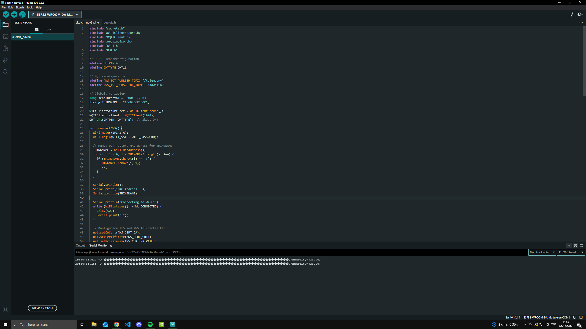
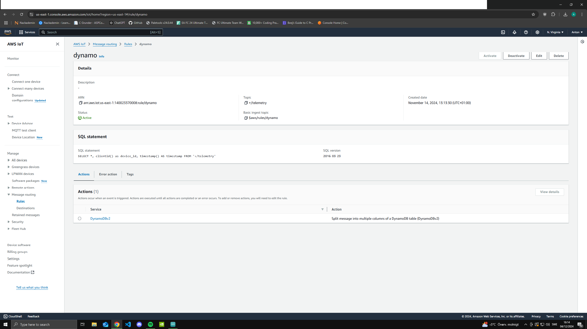
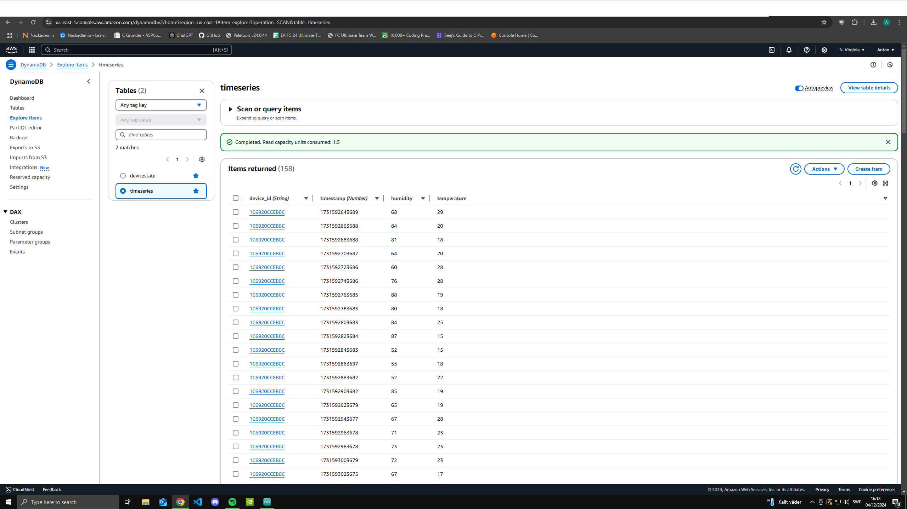
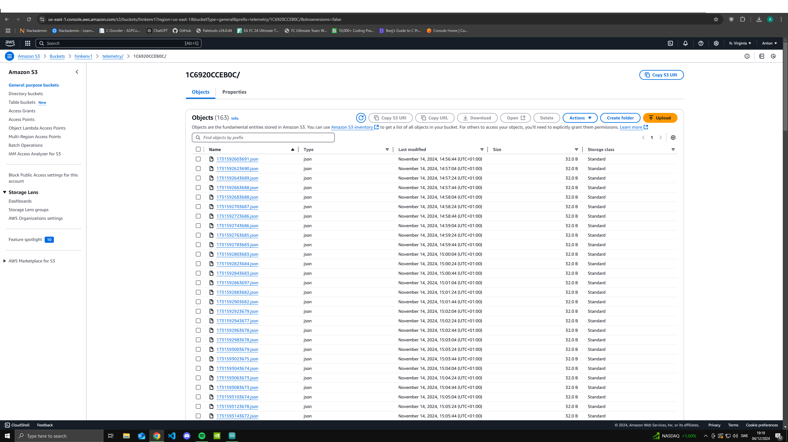
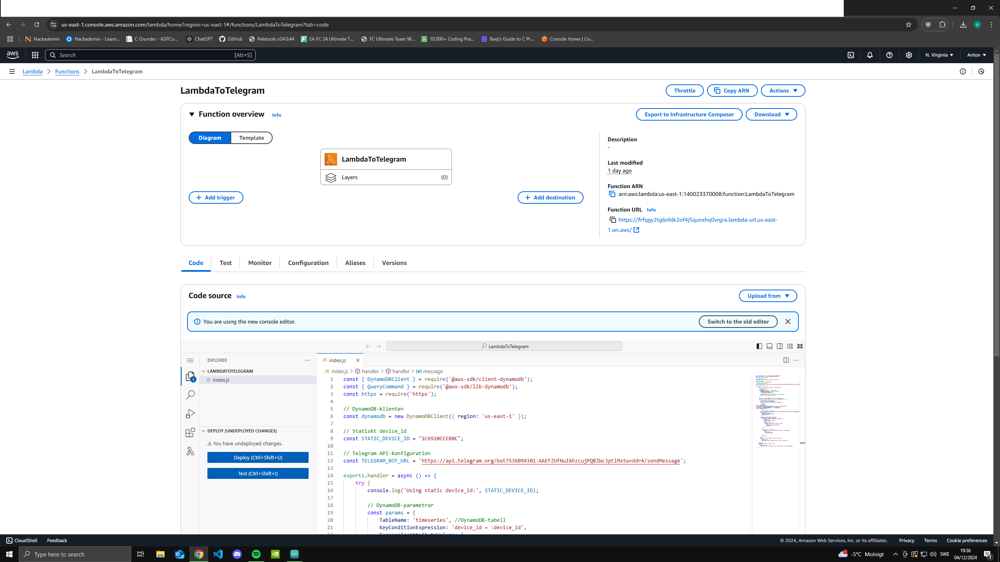
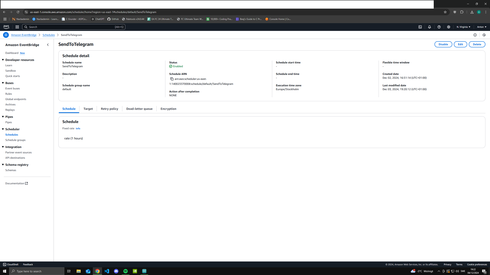
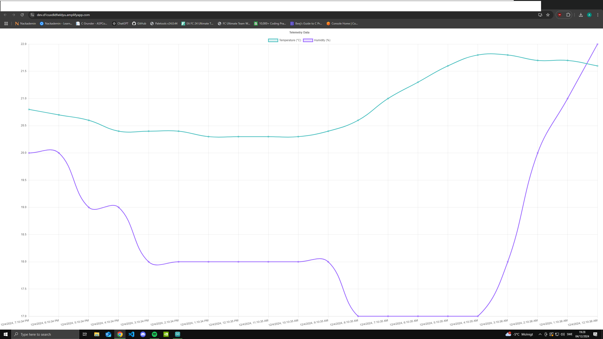

# AWS IoT Core HUM/TEMP Sensor Projekt

Detta projekt syftar till att skapa en robust IoT-lösning för övervakning av inomhustemperatur och luftfuktighet. Med hjälp av ESP32-enheter och AWS-molntjänster erbjuder lösningen säker och skalbar hantering av data. Användare får tillgång till en användarvänlig React-baserad frontend för visualisering, samt ett notifieringssystem via Telegram som håller dem uppdaterade med aktuell temperatur och luftfuktighet. Lösningen är designad för att möta både tekniska och användarbehov, med hög säkerhet och stöd för framtida expansion.

---
## Use Case

Lösningen är designad för att möta behovet av säker och pålitlig övervakning av lägenhetens temperatur och luftfuktighet:

- **Utgångspunkt i behov och användning**:
   - Systemet levererar realtidsdata och historiska analyser för att ge en tydlig överblick över inomhusklimatet.
   - Telegram-notifieringar skickas regelbundet för att hålla användaren uppdaterad med aktuell temperatur och fuktighet, oavsett var hen befinner sig.

- **Skalbar och säker infrastruktur**:
   - Lösningen är framtidssäker och kan enkelt skalas för att inkludera fler sensorer och användare.
   - Säkerhet är en kärnfunktion och tillämpas genom krypterad kommunikation, certifikathantering och rollbaserad åtkomstkontroll.

- **Flexibel datavisualisering**:
   - Realtidsdata ger direkt insikt i aktuella förhållanden, medan historiska data kan användas för att identifiera trender över tid.
   - DynamoDB möjliggör snabb dataåtkomst för analyser, medan S3 används för kostnadseffektiv lagring av stora datamängder och aggregerad analys.

---

## Arkitekturöversikt

### Komponenter och Funktioner

1. **ESP32 med DHT-sensor**:
   - Samlar kontinuerligt in temperatur- och luftfuktighetsdata.
   - Publicerar data till AWS IoT Core via MQTT, vilket möjliggör säker och stabil överföring även vid nätverksvariationer.

   
   

2. **AWS IoT Core**:
   - Central hubb för att hantera datainsamling från flera IoT-enheter.
   - Säkerställer tillförlitlig och krypterad kommunikation mellan enheter och molntjänster.
   - Stödjer skalbar tillväxt för fler sensorer och ökande datavolymer.

3. **AWS Rules Engine**:
   - Hanterar och dirigerar dataflöden till olika tjänster baserat på definierade regler.
   - Dirigerar data till DynamoDB för snabb åtkomst och till S3 för långsiktig lagring.

   

4. **DynamoDB**:
   - Lagrar sensordata för snabb åtkomst och sökbarhet (Hot Storage).
   - Perfekt för realtidsanalys av sensordata och visning i frontend.

   
     
5. **S3 Bucket**:
   - Lagrar rå sensordata för långsiktig lagring och säkerhetskopiering (Warm Storage).
   - Idealisk för lösningar som kräver skalbar och kostnadseffektiv lagring av stora datamängder.

   

6. **AWS Lambda**:
   - Bearbetar inkommande data och exponerar API:er för frontend.
   - Används för att trigga notifieringar via Telegram och hantera användarspecifika funktioner.

   

7. **EventBridge**:
   - Triggar Lambda-funktioner baserat på specifika regler, klockslag eller tröskelvärden.
   - Automatiserar flöden för notifieringar och databehandling.

   

8. **AWS Amplify med React**:
   - Ett användarvänligt gränssnitt som visar realtidsdata och historiska trender.
   - Kombinerar flexibilitet och enkelhet för att möta användarnas behov.

   

9. **Telegram Bot**:
   - Skickar notifieringar till användaren för att hålla dem uppdaterade med aktuell temperatur och luftfuktighet.
   - Gör det möjligt att få viktig information direkt, oavsett var användaren befinner sig.

   

---

## Framtida Utvecklingsmöjligheter

1. **Prediktiv analys med maskininlärning**:
   - Historisk data kan analyseras med AWS SageMaker för att förutse trender eller mönster i temperatur och luftfuktighet.

2. **Utökning till fler enheter**:
   - Lösningen kan skalas för att inkludera fler sensorer och datatyper, exempelvis CO2-nivåer eller ljusmätningar.

3. **Avancerade notifieringar**:
   - Möjligheten att anpassa notifieringar baserat på specifika gränsvärden och preferenser för varje användare.

4. **Integrering med externa system**:
   - Export av data till externa verktyg som Power BI eller Google Sheets för ytterligare analys och rapportering.

---

## Sammanfattning

Projektet kombinerar säkerhet, skalbarhet och användarvänlighet för att skapa en tillförlitlig IoT-lösning. Med regelbundna Telegram-notifieringar och en skalbar design är systemet väl lämpat för både nuvarande behov och framtida utvecklingsmöjligheter. Denna lösning erbjuder en robust och flexibel plattform för övervakning och analys av inomhusklimat.

